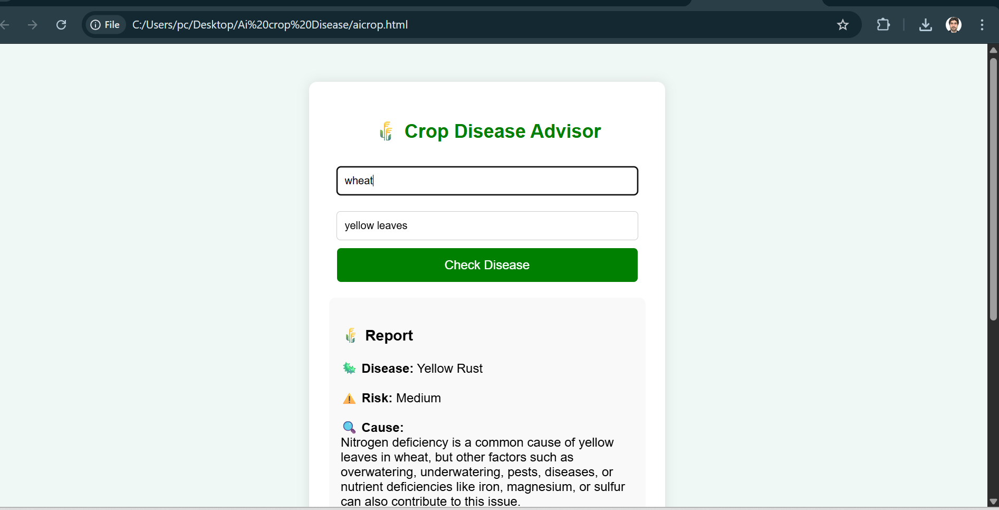
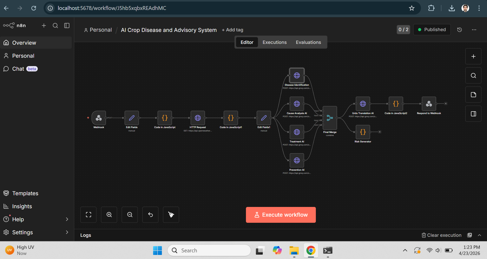

# 🌾 AgriAI Advisor

AI-based Crop Disease Detection and Advisory System for Pakistan.

---

## 📌 Problem
Farmers face difficulty in identifying crop diseases on time, leading to crop loss.

---

## 💡 Solution
This system uses AI and automation to:
- Detect crop diseases
- Analyze causes
- Suggest treatment
- Provide prevention tips

---

## ⚙️ System Workflow
User Input → Data Processing → Weather API → AI Analysis → Output

---

## 🧠 Technologies Used
- n8n (Workflow Automation)
- Groq API (AI)
- OpenWeather API
- HTML, CSS, JavaScript

---

## 📸 Screenshots

## 🖥 UI

## ⚙️ Workflow

---

## 📂 Project Structure
AgriAI-Advisor/
├── report/        # Project documentation
├── workflow/      # n8n workflow JSON
├── ui/            # Frontend interface
├── assets/        # Screenshots and media
